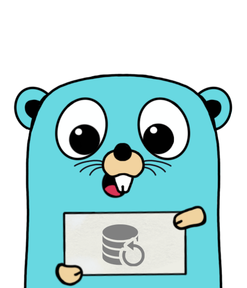

# go-accumulator

[](https://pkg.go.dev/github.com/nar10z/go-accumulator)
[](https://goreportcard.com/report/github.com/nar10z/go-accumulator)
[](https://codecov.io/gh/nar10z/go-accumulator)

Solution for accumulation of events and their subsequent processing.



```
go get github.com/nar10z/go-accumulator
```

## What for?

Sometimes there is a situation where processing data on 1 item is too long.
The [go-accumulator](https://github.com/nar10z/go-accumulator) package comes to the rescue!

The solution is to accumulate the data and then process it in a batch. There are 2 situations where the processing
function (**flushFunc**) is called:

- Storage fills up to the maximum value (**flushSize**).
- The interval during which the data is accumulated (**flushInterval**) passes

The accumulator provides 2 methods:

- AddAsync - adding data without waiting for execution
- AddSync - adding data with a wait for execution

## Example

```go
package main

import (
	"context"
	"fmt"
	"strings"
	"sync"
	"time"

	goaccum "github.com/nar10z/go-accumulator"
)

func main() {
	ctx, cancel := context.WithTimeout(context.Background(), time.Minute)
	defer cancel()

	const (
		countSync  = 4
		countAsync = 3
	)

	accumulator := goaccum.New[string](3, time.Second, func(events []string) error {
		fmt.Printf("Start flush %d events:\n", len(events))
		for _, e := range events {
			fmt.Printf(" - %s\n", e)
		}
		fmt.Printf("Finish\n%s\n", strings.Repeat("-", 100))
		return nil
	})

	var wg sync.WaitGroup
	wg.Add(countSync + countAsync)

	go func() {
		for i := 0; i < countAsync; i++ {
			err := accumulator.AddAsync(ctx, fmt.Sprintf("async #%d", i))
			if err != nil {
				fmt.Printf("failed add event: %v\n", err)
			}
			wg.Done()
		}
	}()

	go func() {
		for i := 0; i < countSync; i++ {
			i := i
			go func() {
				err := accumulator.AddSync(ctx, fmt.Sprintf("sync #%d", i))
				if err != nil {
					fmt.Printf("failed add event: %v\n", err)
				}
				wg.Done()
			}()
		}
	}()

	wg.Wait()

	accumulator.Stop()
}

```

### output:

```text
Start flush 3 events:
 - sync #3
 - async #0
 - async #1
Finish
--------------------
Start flush 3 events:
 - async #2
 - sync #0
 - sync #1
Finish
--------------------
Start flush 1 events:
 - sync #2
Finish
--------------------
```

## License

[MIT](https://raw.githubusercontent.com/nar10z/go-accumulator/main/LICENSE)
